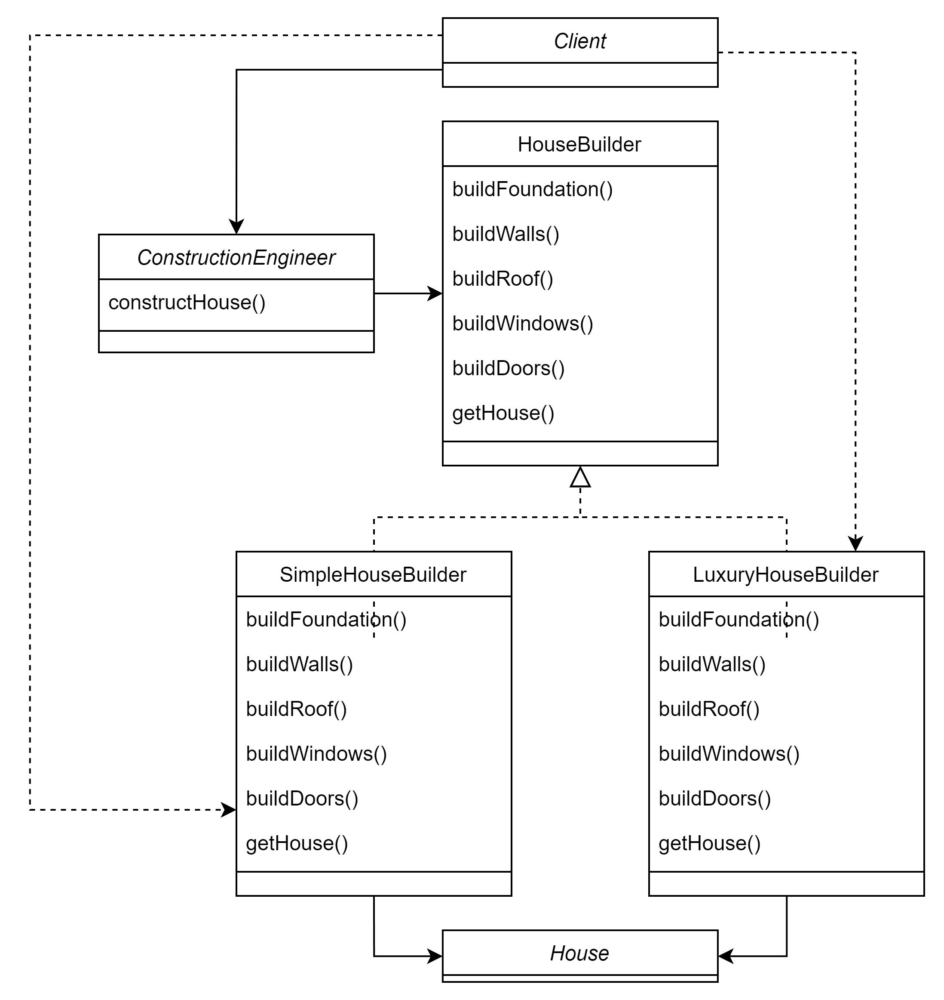
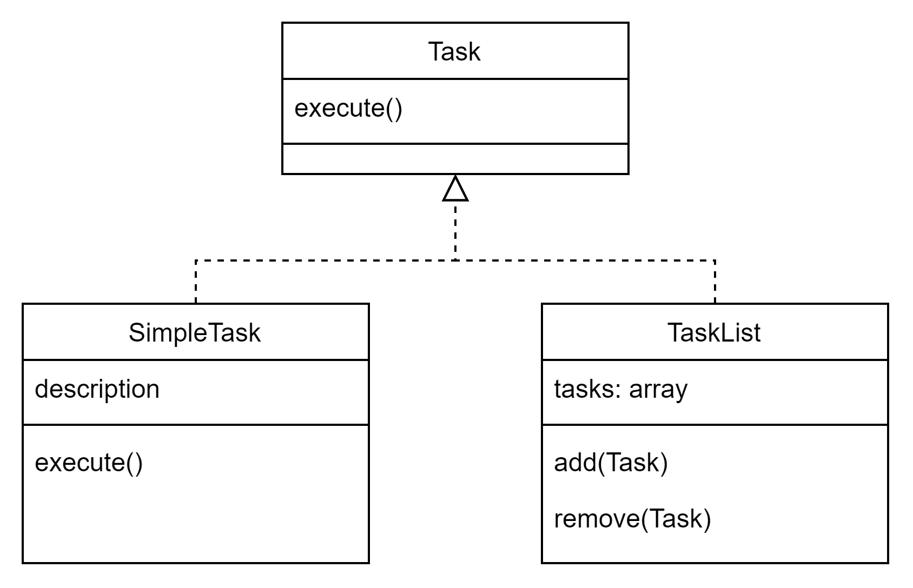
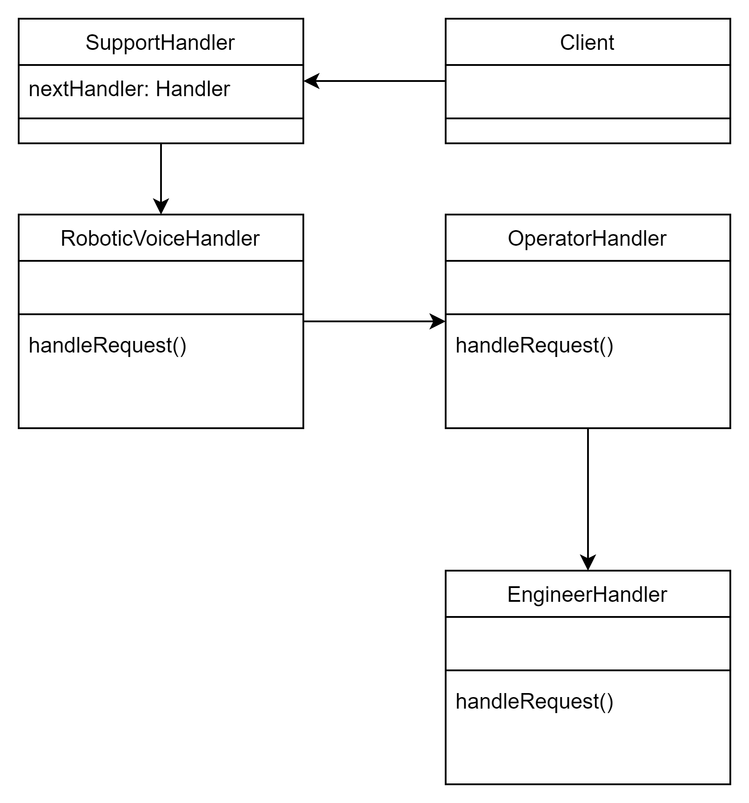

# Builder - Padrão Criacional

Esse padrão é utilizado quando queremos separar a construção de um objeto complexo de sua representação, permitindo a criação de diferentes tipos de objetos usando os mesmos passos de construção. Ele resolve o problema de construir objetos complexos de forma flexível, sem a necessidade de um construtor complexo com muitos parâmetros.

Ademais, o padrão também permite a construção de objetos complexos passo a passo, onde cada etapa é realizada por um método específico. Ele fornece um direcionamento claro para a construção do objeto e permite a criação de diferentes variantes do objeto sem poluir a classe principal com diversos construtores.

### Explicação do Código

- [Código JS](padroesCriacionais.js).

- **House**: Representa o objeto a ser construído. Possui propriedades como fundação, paredes, telhado, janelas e portas.

- **HouseBuilder**: Define a interface para os construtores de casa. Possui métodos para construir cada parte da casa e para obter a casa construída.

- **SimpleHouseBuilder** e **LuxuryHouseBuilder**: Implementam os métodos de construção da interface HouseBuilder para construir diferentes tipos de casas.

- **ConstructionEngineer**: Recebe um construtor de casa e é responsável por dirigir o processo de construção, chamando os métodos de construção na ordem correta.

---

# Composite - Padrão Estrutural

Esse padrão é útil quando precisamos representar uma estrutura hierárquica de objetos onde os objetos individuais e os compostos (que contêm outros objetos) devem ser tratados de maneira uniforme. O problema é como tratar uma coleção de objetos de maneira uniforme, independentemente de serem objetos simples ou compostos.

Por isso, o padrão Composite sugere que usemos uma única interface para objetos individuais e compostos, permitindo que sejam tratados de forma uniforme. Assim, podemos tratar tanto objetos individuais quanto composições de objetos da mesma maneira.

### Explicação do Código

- [Código JS](padroesEstruturais.js).

- **Task:** Define a interface comum para todas as tarefas, com um método execute() que deve ser implementado por todas as subclasses.

- **SimpleTask:** Implementa uma tarefa individual com um método execute() que imprime a descrição da tarefa.

- **TaskList:** Implementa uma lista de tarefas que pode conter tarefas individuais e sub-listas de tarefas. O método execute() é sobrescrito para executar todas as tarefas na lista, inclusive as sub-listas.

---

# Chain of Responsibility - Padrão Comportamental

Esse padrão resolve o problema de desacoplamento entre remetentes e destinatários de uma solicitação. Ele permite que várias classes possam lidar com uma solicitação, dando a cada uma a oportunidade de processá-la ou passá-la adiante na cadeia. Isso permite uma flexibilidade na forma como uma solicitação é manipulada, pois cada objeto pode decidir como lidar com ela.

### Explicação do Código

- [Código JS](padroesComportamentais.js).

- **Client:** Inicia a solicitação para o primeiro handler na cadeia.

- **SupportHandler:** Classe base para todos os handlers. Possui um campo nextHandler que referencia o próximo handler na cadeia. Define o método handleRequest() para lidar com solicitações.

- **RoboticVoiceHandler, OperatorHandler, EngineerHandler:** ConcreteHandlers que estendem SupportHandler e implementam a lógica para lidar com tipos específicos de solicitações.

